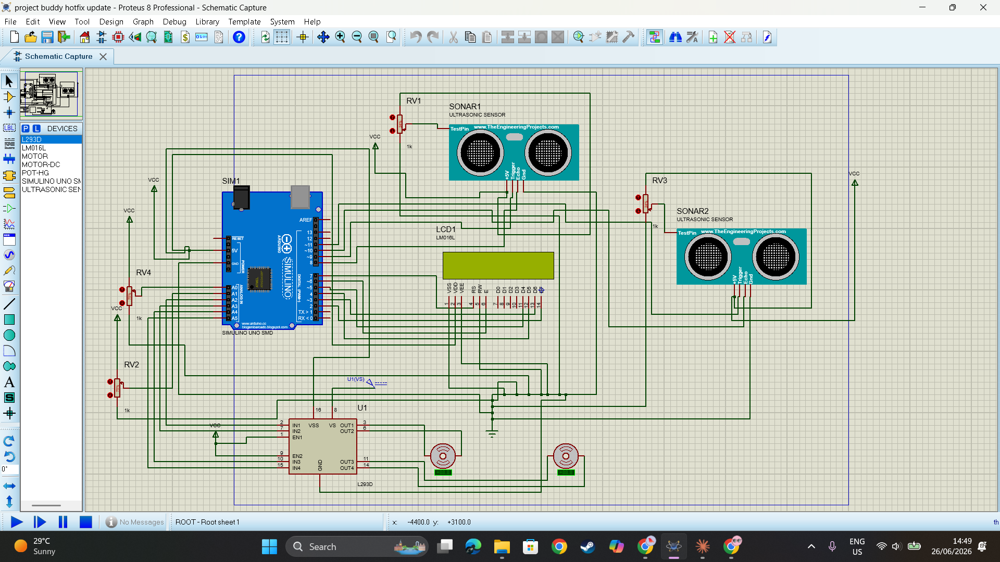

# Project Buddy — Navigation V1.5
### Differential Drive Motor Integration (I.A.M.U.)
**Designed & Simulated by Hope Gumede | Botho University | Gaborone, Botswana**

---

## What This Is

V1.5 is the physical actuator layer of Project Buddy — the bridge between 
thinking and moving.

Where V1 taught Buddy to *think* about his environment, V1.5 teaches him 
to *act* on those thoughts. The same binary state machine from V1 now 
directly commands two DC motors through an L293D H-Bridge driver, 
translating navigation decisions into real physical movement across a 
2D plane.

Buddy can now navigate.

---

## What Changed From V1

| Feature | V1 | V1.5 |
|---|---|---|
| Sensors | 2x HC-SR04 | 2x HC-SR04 |
| Decision Logic | State Machine | State Machine (identical) |
| Output | LCD display only | LCD + Physical Motor Drive |
| Motors | None | 2x DC Motors via L293D |
| Steering | Simulated states only | Differential pivot drive |
| Actuator Pins | None | A2, A3, A4, A5 as GPIO |

---

## System Components

| Component | Role |
|---|---|
| ATmega328P (Arduino Uno) | Core microcontroller |
| 2x HC-SR04 Ultrasonic Sensors | Left and right environmental scanning |
| 2x Potentiometers (RV2, RV4) | Independent dynamic threshold control per sensor |
| L293D H-Bridge Motor Driver | Bidirectional motor control |
| 2x DC Motors | Physical differential drive wheels |
| 16x2 LCD Display | Live telemetry — distances, thresholds, active state |

---

## Differential Drive — How Buddy Steers

V1.5 uses pivot steering via differential drive. Each wheel is controlled 
independently — by spinning wheels in opposite directions, Buddy can 
execute sharp pivot turns rather than wide arcing ones.

| State | Left Motor | Right Motor | Result |
|---|---|---|---|
| FORWARD | Forward | Forward | Straight ahead |
| STEER LEFT | Reverse | Forward | Sharp left pivot |
| STEER RIGHT | Forward | Reverse | Sharp right pivot |
| REVERSE | Reverse | Reverse | Full backward drive |

---

## Independent Threshold Calibration

Each ultrasonic sensor has its own dedicated potentiometer:
- **RV2 → A0** — Controls left sensor trigger threshold
- **RV4 → A1** — Controls right sensor trigger threshold

This allows independent hardware-level calibration per side without 
touching the code. In asymmetric environments — where one wall is 
closer than another — each side can be tuned separately for optimal 
navigation response.

Range: 20cm to 100cm per side, independently adjustable.

---

## Key Engineering Decisions

**Analog pins as GPIO:** Motor control lines use A2-A5 as digital 
outputs, freeing dedicated digital pins for future sensor expansion 
in V2. Valid on ATmega328P architecture — analogRead and digitalWrite 
can coexist on the same pins when used at different times.

**Interleaved sensor sampling:** 20ms acoustic dissipation buffer 
between left and right sensor readings prevents cross-talk interference.

**Safe initialization:** All motor pins initialize to LOW on startup, 
preventing unintended motor activation during boot sequence.

**30ms pulseIn timeout:** Prevents system freeze if no echo returns — 
defaults to 999cm and continues navigation loop.

---

## Simulation Note

Simulated at 4MHz clock frequency to compensate for host machine 
processing limitations in Proteus. Logic architecture is identical 
to standard 16MHz physical deployment.

---

## Circuit Schematic

---

## The Roadmap

- **Phase 1 (Complete):** Proximity sensing and warning system ✅
- **V1 (Complete):** Binary decision logic state machine ✅
- **V1.5 (Complete):** Physical motor drive integration ✅
- **V2 (Next):** Four directional awareness — front, back, left, right
- **Final Year:** Full autonomous physical build with Bluetooth 
  distress communication
- **Vision:** Sound source localization, voice recognition, 
  AI integration — Buddy finds you, faces you, responds to you

---

*Built from Gaborone, Botswana. Starting small. Thinking big.* 🇧🇼
